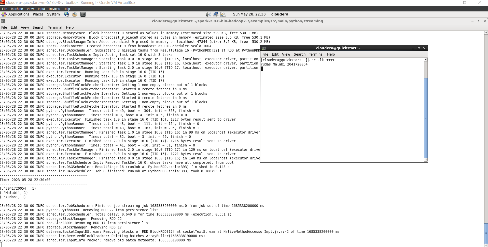
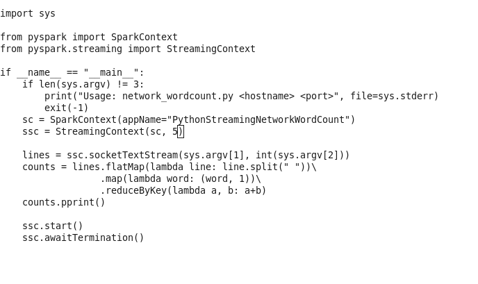
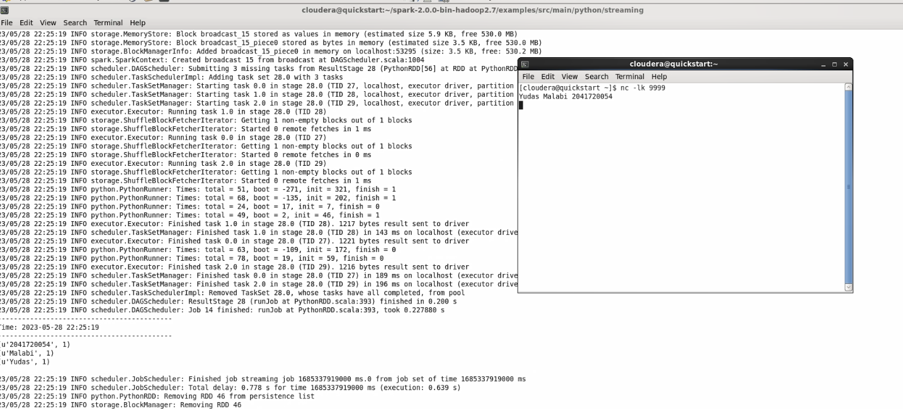
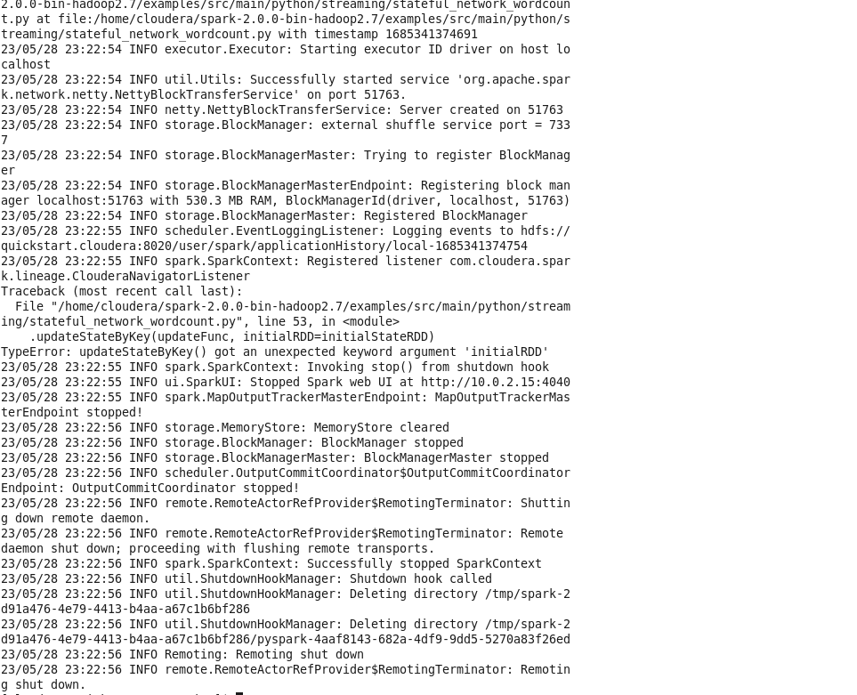
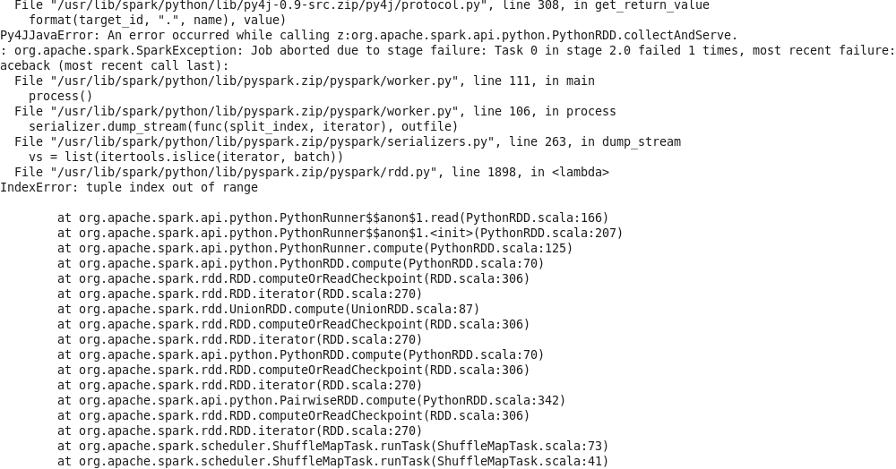

# Praktikum Chapter 5

Nama : Yudas Malabi

Kelas : TI 3C / 20

NIM : 2041720054

1. Metode 1, Stateless Stream Processing

    menjalankan file network_wordcount.py dengan menjalankan 2 terminal, untuk eksekusi file dan sebagai netcat listener

    

    Selanjutnya, ubah interval yang awalnya 1 detik menjadi 5 detik

    

    

2. Metode 2, Statefull Stream Processing

    

    terdapat error pada script python, dimana mengakibatkan proses running shutdown secara otomatis.

3. Metode 3, Transformasi pada Park Streaming.

    

    terdapat error pada dataset, yaitu tuple index out of range.

# Tugas Teori Praktikum

1. Kode 1
    * mylist & myschema : merupakan list, array / data awal yang digunakan untuk membuat dataframe
2. Kode 2
    * spark.createDataFrame : Membuat DataFrame dari RDD, daftar, atau pandas.DataFrame.
3. Kode 3
    * parallelize : kumpulan list untuk membentuk RDD.
    * toDF : Mengubah Dataset menjadi DataFrame dengan kolom baru.

4. Kode 4
    * hadoop : platform perangkat lunak yang memungkinkan pengolahan data secara terdistribusi pada cluster besar yang terdiri dari ribuan node dan kapasitas data mencapai petabyte.
    * fs :  menyediakan akses ke berbagai sistem file termasuk Hadoop Distributed File System (HDFS) dan sistem file lokal.
    * put : sebuah operasi untuk mengunggah file atau objek dari mesin lokal atau virtual ke sistem penyimpanan objek pada PySpark.
5. Kode 5
    * pyspark.sql : Mengembalikan DataFrame yang mewakili hasil kueri yang diberikan.
    * SQLContext : membuat DataFrame, mendaftarkan DataFrame sebagai tabel, mengeksekusi SQL, dll.
    * createOrReplaceTempView : Membuat atau mengganti tampilan sementara lokal dengan DataFrame ini.
    * show : Mencetak n baris pertama ke konsol.